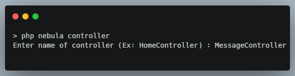
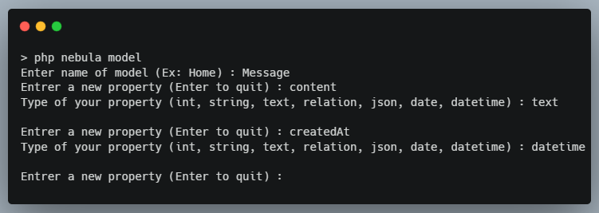
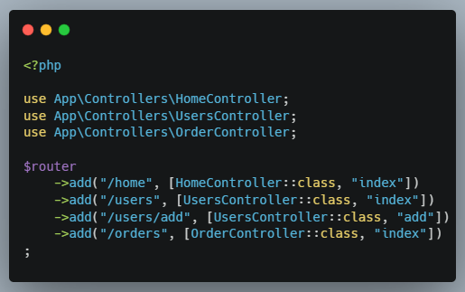
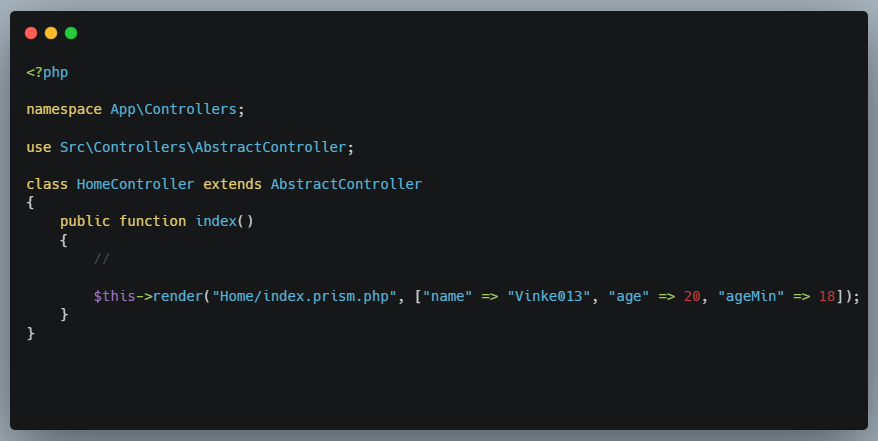
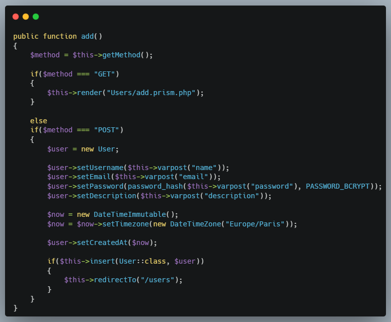
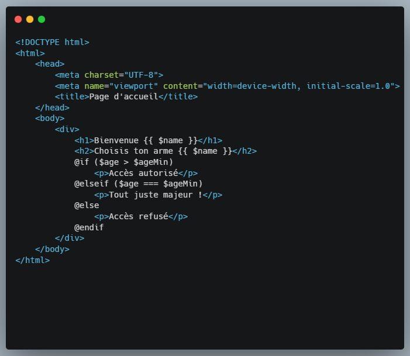

# 🚀 NovaPHP — Mini-framework basé sur du PHP natif

Qu'y a-t-il vraiment sous le capot de frameworks comme Symfony ou Laravel ? Pour le comprendre, rien de mieux que de concevoir le sien à partir de zéro, PHP 8 fournissant nativement tous les outils nécessaires. Même si NovaPHP est loin de prétendre rivaliser avec ces géants de l'écosystème, sa conception a représenté un challenge technique aussi stimulant qu'enrichissant.

---

## 📸 Aperçu et fonctionnalités

NovaPHP intègre son propre outil en ligne de commande pour accélérer la création de composants :

### ⚡CLI / Générateur de code (nebula)

#### Génération de contrôleurs :


#### Génération de modèles :


### 🔀 Routage dynamique

Un système de routage déclaratif associant directement les URL aux contrôleurs et méthodes applicatives :

#### Déclaration de routes :


### 🎮 Contrôleurs & Formulaires

Prise en charge native du cycle de vie des requêtes (GET / POST), gestion des entrées, hashage de sécurité et persistance BDD via l'ORM maison :

#### Rendu simple et transmission de données


#### Traitement de formulaires et persistance


### 🎨 Moteur de templates (Prism)

Un moteur de rendu léger supportant l'interpolation de variables ({{ $var }}) et des structures de contrôle expressives (@if, @elseif, @else) :

#### Rendu simple et transmission de données


---

## 🛠️ Prérequis

- **PHP** >= 8.1 (avec extension PDO activée)
- **MySQL / MariaDB**
- **Composer** (pour l'autoloading PSR-4)

## ⚡ Installation

1. **Cloner le projet**
   ```bash
   git clone https://github.com/KevinGL/NovaPHP.git
   cd NovaPHP
   ```

2. **Installer les dépendances d'autoloading**
   ```bash
   composer dump-autoload
   ```

3. **Configuration de l'environnement**
   ```bash
	cat <<EOT> .env
	DATABASE_URL=...
	EOT
	```

4. **Lancer le serveur de développement**
   ```bash
   php nebula serve
   ```

## 🏛️ Architecture & Structure du projet

Affiche l'organisation des dossiers pour montrer la séparation stricte entre le cœur du framework et le code applicatif :

```text
NovaPHP/
├── app/               # Code applicatif
│   ├── Controllers/   # Contrôleurs web
│   ├── Core/          # Kernel, routeur, cache template
│   ├── Migrations/    # Stockage migrations
│   ├── Models/        # Entités & Modèles de données
│   ├── Routes/        # Déclaration des routes
│   └── Views/         # Templates (.prism.php)
├── public/            # Front Controller (point d'entrée unique)
│   └── index.php
├── src/               # Classe mère contrôleurs
├── nebula             # CLI maison pour la génération de code
└── .env               # Variables d'environnement
```

## 🎯 Fonctionnalités techniques clés (Technical Highlights)

- **Hydratation avancée via ReflectionClass :** Mapping automatique des colonnes snake_case de la BDD vers les propriétés camelCase des modèles, avec prise en charge des objets DateTimeImmutable.
- **Zero-dependency Core :** Moteur MVC et CLI entièrement conçus nativement sans bibliothèques tierces.
- **Sécurité BDD :** Binding strict des paramètres PDO sur toutes les requêtes d'insertion et de sélection.
